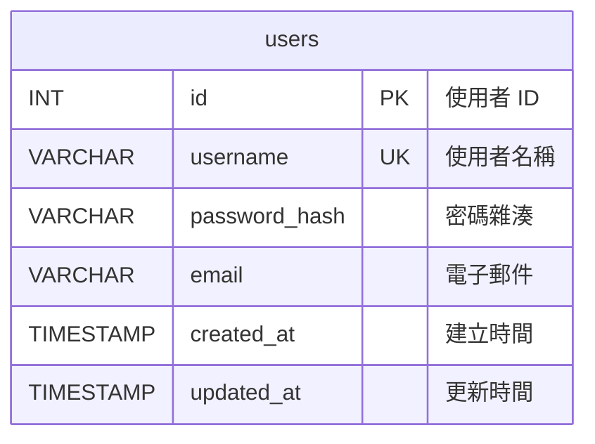

# 資料庫結構文件

本文檔記錄了應用程式的資料庫結構，包含資料表、欄位定義、實體關聯圖與 SQL 語句。

## 資料庫資訊

- **資料庫名稱**: `app_db`
- **字元集**: `utf8mb4`
- **排序規則**: `utf8mb4_unicode_ci`
- **儲存引擎**: `InnoDB`

## 資料表結構

### users（使用者資料表）

使用者帳號與認證資訊。

| 欄位名稱 | 資料型態 | 約束條件 | 預設值 | 說明 |
|---------|---------|---------|--------|------|
| `id` | INT | PRIMARY KEY, AUTO_INCREMENT | - | 使用者唯一識別碼 |
| `username` | VARCHAR(50) | NOT NULL, UNIQUE | - | 使用者名稱（唯一） |
| `password_hash` | VARCHAR(255) | NOT NULL | - | 密碼雜湊值（使用 werkzeug.security） |
| `email` | VARCHAR(100) | NULL | NULL | 電子郵件地址 |
| `created_at` | TIMESTAMP | - | CURRENT_TIMESTAMP | 帳號建立時間 |
| `updated_at` | TIMESTAMP | - | CURRENT_TIMESTAMP ON UPDATE CURRENT_TIMESTAMP | 最後更新時間 |

#### 索引

- **PRIMARY KEY**: `id`
- **UNIQUE INDEX**: `username` (idx_username)

#### 說明

- `password_hash`: 使用 `werkzeug.security.generate_password_hash()` 產生，使用 `check_password_hash()` 驗證
- `username`: 必須唯一，用於登入識別
- `email`: 可選欄位，未來可用於密碼重設等功能

## 實體關聯圖（ER Diagram）



## SQL 建立語句

### 建立資料庫

```sql
CREATE DATABASE IF NOT EXISTS `app_db` 
CHARACTER SET utf8mb4 
COLLATE utf8mb4_unicode_ci;
```

### 建立 users 資料表

```sql
CREATE TABLE IF NOT EXISTS `users` (
    `id` INT AUTO_INCREMENT PRIMARY KEY COMMENT '使用者 ID',
    `username` VARCHAR(50) NOT NULL UNIQUE COMMENT '使用者名稱',
    `password_hash` VARCHAR(255) NOT NULL COMMENT '密碼雜湊值',
    `email` VARCHAR(100) COMMENT '電子郵件',
    `created_at` TIMESTAMP DEFAULT CURRENT_TIMESTAMP COMMENT '建立時間',
    `updated_at` TIMESTAMP DEFAULT CURRENT_TIMESTAMP ON UPDATE CURRENT_TIMESTAMP COMMENT '更新時間',
    INDEX `idx_username` (`username`)
) ENGINE=InnoDB 
  DEFAULT CHARSET=utf8mb4 
  COLLATE=utf8mb4_unicode_ci 
  COMMENT='使用者資料表';
```

## 初始化方式

### 方式一：使用 Python 腳本（推薦）

```bash
# 執行初始化腳本
python3 src/scripts/init_db.py

# 或建立預設使用者（從 ENV/.env 讀取設定）
CREATE_DEFAULT_USER=1 python3 src/scripts/init_db.py
```

預設使用者資訊可在 `ENV/.env` 檔案中設定：
- `DEFAULT_USERNAME`: 預設使用者名稱（預設: admin）
- `DEFAULT_PASSWORD`: 預設密碼（預設: admin123）
- `DEFAULT_EMAIL`: 預設電子郵件（預設: admin@example.com）

### 方式二：使用 SQL 腳本

```bash
# 使用 MySQL/MariaDB 客戶端執行
mysql -u root -p < src/scripts/init_db.sql

# 或指定資料庫連線資訊
mysql -h 127.0.0.1 -u root -p app_db < src/scripts/init_db.sql
```

### 方式三：手動執行 SQL

1. 連線到 MariaDB：
```bash
mysql -u root -p
```

2. 執行 SQL 語句（參考上方「SQL 建立語句」）

## 資料表關係

目前資料庫結構較為簡單，僅包含單一 `users` 資料表。未來可擴充的關聯包括：

- **使用者角色關聯**: 可新增 `roles` 資料表與 `user_roles` 關聯表
- **使用者會話**: 可新增 `sessions` 資料表記錄登入狀態
- **使用者活動記錄**: 可新增 `user_activities` 資料表記錄操作日誌

## 安全注意事項

1. **密碼儲存**: 所有密碼必須以雜湊值儲存，絕不儲存明文密碼
2. **SQL Injection 防護**: 所有資料庫查詢必須使用參數化查詢（參數化查詢）
3. **索引優化**: `username` 欄位已建立索引，提升查詢效能
4. **字元集**: 使用 `utf8mb4` 支援完整的 Unicode 字元（包含 emoji）

## 維護與更新

### 查看資料表結構

```sql
DESCRIBE users;
SHOW CREATE TABLE users;
```

### 查看索引

```sql
SHOW INDEX FROM users;
```

### 備份資料表

```bash
mysqldump -u root -p app_db users > users_backup.sql
```

### 還原資料表

```bash
mysql -u root -p app_db < users_backup.sql
```

## 版本歷史

- **v1.0** (初始版本)
  - 建立 `users` 資料表
  - 包含基本使用者認證欄位
  - 支援時間戳記自動更新

